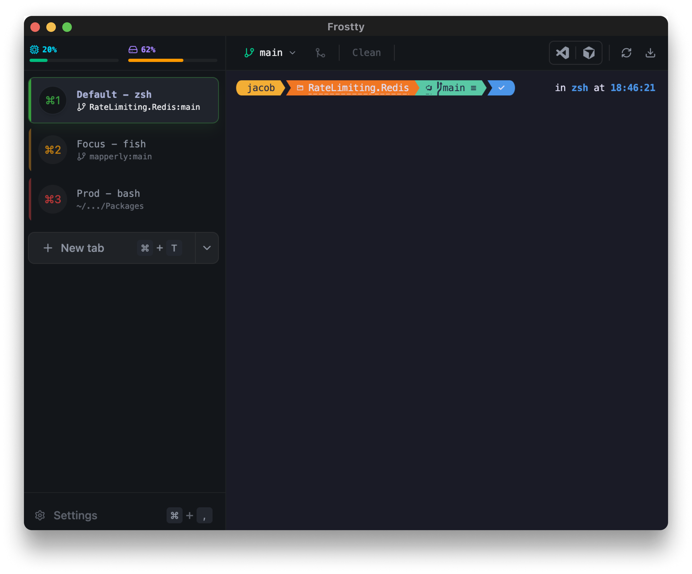

<h1 align="center">
    
    <br>Frostty
</h1>
<br />
<p align="center">
  Cross-platform, feature-rich terminal emulator with a modern UI.
  <br />
  <a href="#about">About</a>
  ·
  <a href="#features">Features</a>
  ·
  <a href="#keyboard-shortcuts">Shortcuts</a>
  ·
  <a href="#developing">Developing</a>
  ·
  <a href="#releases">Releases</a>
  ·
  <a href="#roadmap">Roadmap</a>
</p>



## About

Frostty is a GPU-accelerated terminal emulator. It provides a vertical tab layout, split panes, deep git integration and AI-powered command generation.

The goal is a terminal that feels like a modern development tool rather than a legacy utility. Profiles, a command palette, and editor integration (VS Code, Cursor) keep common workflows a keystroke away.

## Features

Frostty ships with a broad set of features out of the box:

| Category | Details |
| :--- | :--- |
| Tabs | Vertical tab bar, drag-and-drop reordering, tab restoration, per-profile colors |
| Split Panes | Horizontal splits, resizable dividers, drag-to-split, pane navigation |
| Command Palette | Fuzzy-searchable palette for all commands and actions |
| Project Palette | Quick-switch between git repositories with recent project history |
| Git Integration | Branch info, ahead/behind counts, staged/unstaged/untracked files, branch switching, fetch, pull |
| AI Mode | Natural language to shell commands via OpenRouter (configurable model) |
| Profiles | Multiple profiles with per-profile shell, working directory, and tab color |
| Session Persistence | Restores tabs, scrollback, splits, and active state on relaunch |
| Editor Integration | Open current directory in VS Code or Cursor |
| Rendering | GPU-accelerated via WebGL, 10,000-line scrollback buffer |
| System Stats | Live CPU and memory usage in the tab bar |

## Keyboard Shortcuts

| Shortcut | Action |
| :--- | :--- |
| Cmd + T | New tab |
| Cmd + W | Close tab or pane |
| Cmd + L | Clear tab or pane |
| Cmd + Shift + W | Close window |
| Cmd + Shift + N | New window |
| Cmd + Shift + T | Restore closed tab |
| Cmd + D | Split / unsplit pane |
| Cmd + = or + | Zoom in shell text |
| Cmd + - | Zoom out shell text |
| Cmd + 0 | Reset shell text zoom |
| Cmd + Up/Down | Navigate panes or tabs |
| Cmd + 1-9 | Switch to tab by index |
| Cmd + Shift + P | Command palette |
| Cmd + P | Project palette |
| Cmd + K | AI command mode |
| Cmd + , | Settings |
| Cmd + Shift + V | Open in VS Code |
| Cmd + Shift + C | Open in Cursor |

## Developing

### Prerequisites

- Node.js 20+
- pnpm 10+

### Quick Start

```bash
pnpm install
pnpm run dev
```

### Building

```bash
# Current platform
pnpm run package

# Specific platforms
pnpm run package:mac
pnpm run package:win
pnpm run package:linux
```

Built artifacts are written to `dist/`.

### Testing & Linting

```bash
pnpm test              # run all tests
pnpm run test:watch    # watch mode
pnpm run test:ui       # UI tests
pnpm run test:main     # main process tests
pnpm run lint          # lint
pnpm run format        # format
```

### Updating App Icons

```bash
pnpm run build-icons
```

Run this when `resources/logo.png` or `resources/logo_canary.png` changes. Generated icons in `build/` are committed.

## Releases

- Stable releases are created by release-please and use tags like `v0.1.3`.
- Version bumps follow Conventional Commits in PR titles or squash commit messages:
  - `fix:` -> patch
  - `feat:` -> minor
  - `feat!:` or `BREAKING CHANGE:` -> major
- Canary prereleases are created from `main` with tags like `canary-YYYYMMDD-HHMM-<shortsha>`.
- Canary artifacts are currently macOS-only.
- Canary builds do not modify `package.json` version.
- Stable builds use the production auto-update feed (`latest`).
- Canary builds use a separate prerelease auto-update feed (`canary`).
- Stable and canary installers include their updater metadata artifacts in the same GitHub release.
- Canary uses a separate app identity (`io.frostty.app.canary` / `Frostty Canary`) and installs side-by-side with stable.
- Stable and canary macOS artifacts are code-signed in CI using Apple Developer credentials.
- Stable `v*` releases are notarized by default.
- Build metadata (commit SHA and build date) is logged at startup and shown in About panel credits.

## Roadmap

The high-level plan for the project, roughly in priority order:

|  #  | Feature | Status |
| :-: | :--- | :---: |
| 1 | Theming support | Planned |
| 2 | Hotkey remapping settings | Planned |
| 3 | Kitty graphics protocol | Blocked ([xtermjs#5592](https://github.com/xtermjs/xterm.js/issues/5592)) |

## License

MIT
